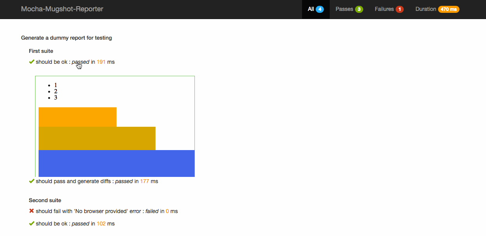

# mugshot-demo

*Visual regression testing demo with [Mugshot](https://github.com/uberVU/mugshot) and [React Component Playground](https://github.com/skidding/react-component-playground)*

## How to run

1. Install required packages
```bash
npm install
```
1. Install [selenium-standalone](https://github.com/vvo/selenium-standalone) and start a server
```bash
npm install selenium-standalone@latest -g
selenium-standalone install
selenium-standalone start
```
1. Run a Component Playground instance locally
```bash
npm run playground
```
The visual test suite will iterate through each component/fixture pair in the playground and check for differences.
1. Run the visual test suite
```bash
npm run test:visual
```
This will generate the baseline screenshots the first time and will check for differences in subsequent runs.
1. Make a change to the styles of any component (ex: [button.less](https://github.com/react-bucharest/mugshot-demo/blob/master/src/button/button.less)) and re-run the tests.
1. Finally inspect the diffs inside the reporter by opening `visual-report/statics/index.html` in any browser.

